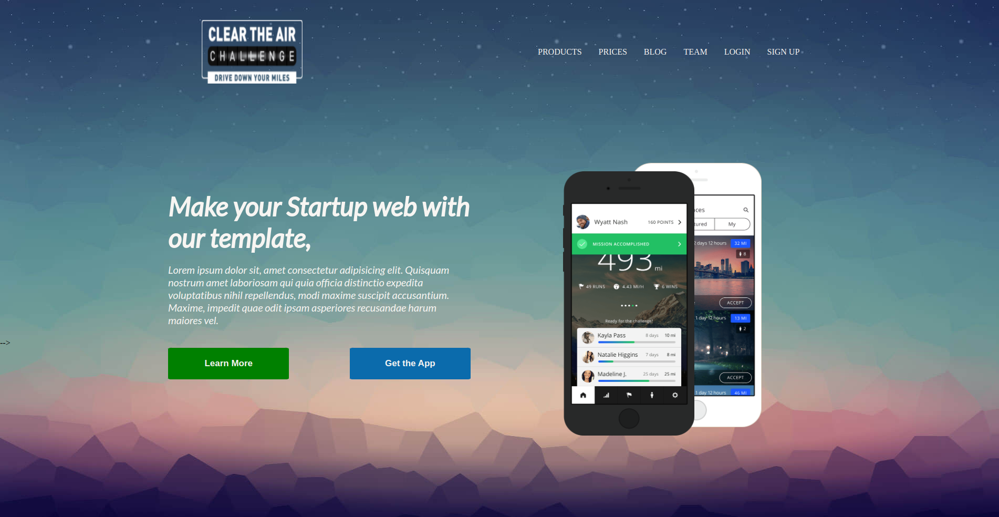

## Mobile-app/Webpage Practice

For this practice it is required:
1. Create a webpage using Html and Css.
2. Follow the example for the layout.
3. Create a Repository in GH.

## About the project:
> This project shows how positioning and FlexBox can be implemented while creating an app.

- **Description:**
> For this project it was required to create a webpage using Html and Css, and then create a repository in GitHub.

- **- **Developed with:**
- [x] _Html5_
- [x] _Css_
- [ ] _..._

- **Tools:**
- [Visual Studio Code](https://code.visualstudio.com/)

- **Contact:**
GitHub: [erikayanez](https://github.com/) 

